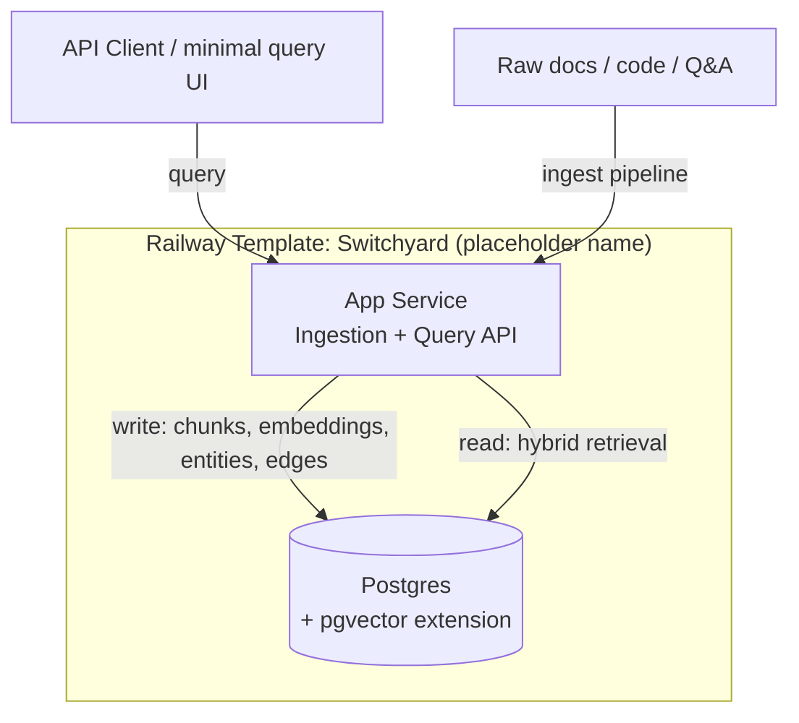

# Switchyard — Railway template design

> **⚠️ PLACEHOLDER NAME.** "Switchyard" (a classification yard — the part of a railyard where cars get sorted and routed onto the right outbound train) is a stand-in chosen for being on-theme and not lame, not the final name. The account owner is still building out the broader Railyard lore/branding — swap this everywhere (directory name, `package.json`, this doc's title, `public/index.html`) once that's settled. Nothing about the architecture depends on the name.

Status: v2, Phases 1–2 built and verified · 2026-07-22 · This is Pillar 2's Phase 1 pick — see `init_rne.md` §2.5, priority row 1.

## Why this template, concretely

Two independent signals from `init_rne.md` §2.4a point at the same thing: vector-DB/AI-infra templates are Railway's historically highest-paid bounty category ($251–400, per GitHub issue history), and composite/opinionated stacks are the rarest, least-contested pattern in the live marketplace (most listings are single-service passthroughs). A hybrid RAG stack is the intersection: AI-infra category, genuinely composite, not just another bare pgvector or Weaviate wrapper.

## 1. System architecture

Two services, not three or four. The obvious design reaches for Postgres + a dedicated vector DB + a dedicated graph DB (Neo4j/FalkorDB) — that's more services to configure, more healthchecks, more volumes, more ways for a template user's first deploy to fail. **pgvector plus a normalized edges table covers vector search and lightweight graph traversal inside one Postgres instance.** Recursive CTEs handle graph queries fine at template scale. Neo4j/FalkorDB stays a documented upgrade path for users who outgrow it, not a default dependency — matches Railway's own "Dry Code" best practice (ship the minimum that works, not everything a power user might eventually want).



## 2. Data model

One Postgres schema carries structured metadata, vector embeddings, and graph relationships — this is the direct answer to "how do you unify Postgres, a vector store, and a knowledge graph": you don't need three systems, you need one schema designed correctly.

```sql
create extension if not exists vector;

-- Structured metadata / source records
create table sources (
  id uuid primary key default gen_random_uuid(),
  source_type text not null,        -- 'doc' | 'code' | 'qa' | 'template'
  title text,
  url text,
  ingested_at timestamptz not null default now()
);

-- Chunked content + embeddings (the "vector DB" role)
create table chunks (
  id uuid primary key default gen_random_uuid(),
  source_id uuid references sources(id) on delete cascade,
  content text not null,
  embedding vector(1536),           -- dimension matches the embedding model in use
  chunk_index int not null,
  created_at timestamptz not null default now()
);
create index on chunks using hnsw (embedding vector_cosine_ops);

-- Entities (the "knowledge graph" nodes)
create table entities (
  id uuid primary key default gen_random_uuid(),
  name text not null,
  entity_type text not null,        -- 'tool' | 'pattern' | 'error' | 'concept'
  description text
);

-- Relationships (the "knowledge graph" edges) — traversal via recursive CTEs, no separate graph DB
create table entity_edges (
  from_entity_id uuid references entities(id) on delete cascade,
  to_entity_id uuid references entities(id) on delete cascade,
  relation text not null,           -- 'causes' | 'requires' | 'alternative_to' | 'part_of'
  primary key (from_entity_id, to_entity_id, relation)
);

-- Bridges vector search and graph traversal: which chunks mention which entities
create table chunk_entities (
  chunk_id uuid references chunks(id) on delete cascade,
  entity_id uuid references entities(id) on delete cascade,
  primary key (chunk_id, entity_id)
);
```

Query strategy (the "retrieval optimization" ask): vector similarity search on `chunks.embedding` gets the semantically closest content; a second pass expands via `entity_edges` from any entities those chunks mention, pulling in related-but-not-textually-similar chunks (the thing pure vector search misses — a chunk about "Redis TCP proxy timeouts" and one about "hairpin NAT" are semantically distant but graph-adjacent via a `causes` edge). That two-step hybrid retrieval is the actual product differentiation, not the schema by itself.

**Verified, not just designed** (2026-07-22, real scratch Railway project — `pgvector/pgvector:pg17` Postgres, deployed app, real OpenAI embeddings, torn down after): ingested three short docs — one about the Redis TCP proxy, one about Postgres private-networking connections, one about Railway billing/egress that never mentions Redis or proxies at all. Querying *"How does the Redis TCP Proxy work for external access?"* with `limit=1` (forcing vector search to surface only the Redis chunk) returned the Postgres doc **and** the billing doc in `graphExpanded` — both connected via a shared `Private Networking` entity, neither would have ranked by text similarity (the billing note especially: topically about egress cost, not proxies). That's the claimed differentiation, not a hypothetical:

```json
"vectorMatches": [{ "content": "The Redis TCP Proxy is a public-facing load balancer...", "similarity": 0.665 }],
"graphExpanded": [
  { "content": "Postgres connections inside a Railway project should use Private Networking..." },
  { "content": "Railway bills usage hourly based on CPU, memory, and network. Egress cost only applies to public internet traffic, not Private Networking..." }
]
```

## 3. Development roadmap

**Phase 1 — deployable core. Done, verified end-to-end 2026-07-22.**
- Postgres service: schema above, pgvector extension enabled, any secrets via template variable functions (never hardcoded).
- App service: ingestion endpoint — chunk text, embed via a pluggable provider, extract entities (rule-based first, LLM-assisted fallback), write to schema.
- App service: query endpoint — hybrid retrieval (vector + graph expansion) as described above.
- Healthcheck, private networking between App and Postgres — confirmed working against a real deployment. Icons, naming, and the official best-practices validator run (`template-best-practices-production.up.railway.app`) are still outstanding — those happen at actual template-composer/publish time, not before.

**Phase 2 — differentiation / immediate usability. Done, 2026-07-22.**
- `scripts/seed-railway-docs.mjs` — fetches five real pages live from `railwayapp/docs` (raw GitHub content, not copied into this repo — stays current, no redistribution baked into the shipped template) and ingests them via a running instance's `/ingest`. All five source URLs verified to resolve (200) before writing the script.
- `public/index.html` — minimal query UI (search box, vector-matches section, graph-expanded section), served via `express.static`. Verified locally: `/` serves it (200, correct title), `/health` still works alongside static serving, unknown paths still 404 — confirmed with a throwaway local smoke test, no Railway infra needed for this part.

**Phase 3 — content (ties to Pillar 1):**
- Deploy-guide blog post carrying the affiliate link (per the existing plan).
- A short "why one Postgres instead of three services" technical note — genuinely differentiated, good SEO, demonstrates real engineering judgment rather than default-reaching-for-more-infra.

## 4. Content strategy (folds in three ideas from chat, all lightweight — no new infra needed)

1. **Deployment recipes** — pre-configured env vars/healthchecks/monitoring bundled per stack type, as accompanying guides once we have 2+ templates to generalize from. Not a new system, just documentation.
2. **"Security-verified" note per template** — a short doc restating best-practices compliance in user-facing language (secrets via template functions, no hardcoded creds, private networking used). Cheap: the validator tool already confirms this, the doc just narrates it.
3. **Migration guides** (Heroku/AWS → Railway) — high-intent SEO content, natural home for the affiliate link, independent of any specific template. Worth doing regardless of which template ships first.

None of these need the RAG stack to exist first — they're writing tasks layered on top of templates, sequenced after product, not gating it.

## Decisions (resolved 2026-07-22, scaffolding started)

- **Embedding provider: OpenAI `text-embedding-3-small`, called via native `fetch`** — no SDK dependency for a single REST endpoint. Output is 1536-dim, matching `chunks.embedding vector(1536)` already. Requires the user to bring `OPENAI_API_KEY`; this is normal for AI-category templates, not unusual friction. Swapping providers later means also updating the vector column dimension — noted in code, not hidden.
- **Entity extraction: rule-based v1**, as originally proposed — multi-word capitalized phrases (`Redis TCP Proxy`) and inline `` `code` `` spans as candidates, co-occurrence within a chunk as edges (`relation = 'co_occurs_with'`, added to the enumerated relation examples alongside `causes`/`requires`/`alternative_to`/`part_of`). LLM-assisted extraction is a documented upgrade path, not built now.
- **Postgres must use the `pgvector/pgvector` image, not Railway's default Postgres template.** Confirmed by the GitHub bounty history itself (§2.4a) — "Add Pgvector Template" was a separately paid $251–400 community request, meaning the stock image doesn't ship the extension. `create extension if not exists vector` will fail otherwise. This is a template-composer step (adding the DB service from that image), not something expressed in this repo's code.
- **Name** — still not decided. Code and docs now use the placeholder **Switchyard** (see the warning banner at the top of this doc) instead of the earlier literal `hybrid-rag-stack`, deliberately left for the account owner to replace once the Railyard lore/branding is finalized. Avoid implying official Railway affiliation regardless of final name (best-practices doc is explicit about this).
